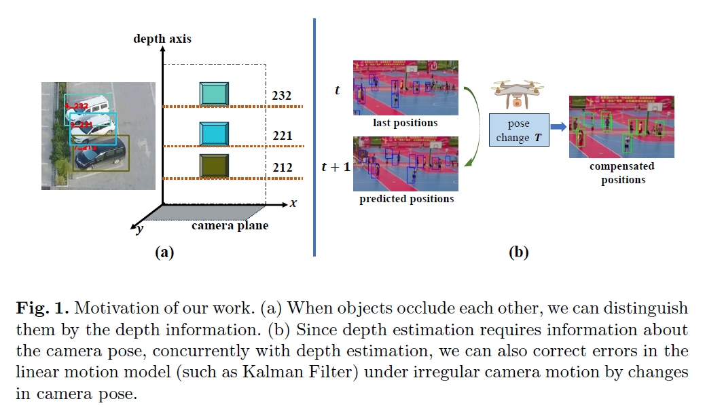
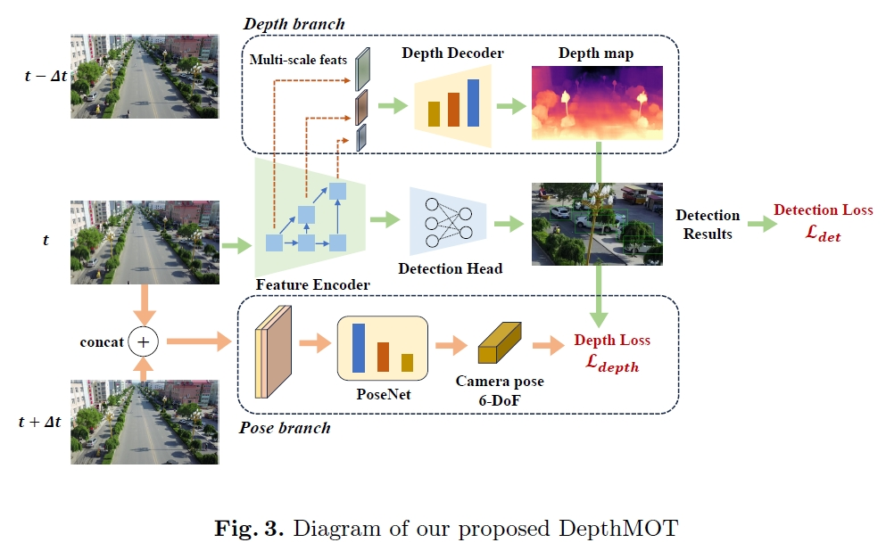

# DepthMOT

****

***Abstract***:

Accurately distinguishing each object is a fundamental goal of Multi-object tracking (MOT) algorithms. However, achieving this goal
still remains challenging, primarily due to: (i) For crowded scenes with occluded objects, the high overlap of object bounding boxes leads to
confusion among closely located objects. Nevertheless, humans naturally perceive the depth of elements in a scene when observing 2D videos. Inspired
by this, even though the bounding boxes of objects are close on the camera plane, we can differentiate them in the depth dimension, thereby
establishing a 3D perception of the objects. (ii) For videos with rapidly irregular camera motion, abrupt changes in object positions can result in
ID switches. However, if the camera pose are known, we can compensate for the errors in linear motion models. In this paper, we propose DepthMOT, which achieves: (i) detecting and estimating scene depth map end-to-end, (ii) compensating the irregular camera motion by camera pose estimation. Extensive experiments demonstrate the superior performance of DepthMOT in VisDrone-MOT and UAVDT datasets.

****


## Model Introduction

We intergrate part of [monodepth2](https://github.com/nianticlabs/monodepth2) and [FairMOT](https://github.com/ifzhang/FairMOT) to estimate the depth of objects and compensate irregular camera motions. Many thanks to their outstanding works! Below are the motivation and paradigm of DepthMOT.





## Installation

Please refer to [FairMOT](https://github.com/ifzhang/FairMOT) to config virtual environment and prepare data.

For VisDrone, UAVDT, KITTI datasets, the data conversion code are available at `src/dataset_tools`

## Model Zoo

**Pretrained model** 
> FairMOT pretrain (COCO) + monodepth2 pretrain (KITTI): 
[BaiduYun, code: us93](https://pan.baidu.com/s/1o8UmTZxALYjlRocCqISxOA)

> VisDrone: 
[BaiduYun, code: za3j](https://pan.baidu.com/s/1KcFwSypaaNcclmb1t9cAwQ)


## Training 

All traning scripts are in `./experiments`

Training visdrone:

```bash
sh experiments/train_visdrone.sh

```

Training uavdt:

```bash
sh experiments/train_uavdt.sh
```

Training kitti:

```bash
sh experiments/train_kitti.sh
```

> Note that if training kitti, it's recommended to modify the input resolution to (1280, 384) in `line 32, src/train.py`:


> `dataset = Dataset(opt, dataset_root, trainset_paths, (1280, 384), augment=False, transforms=transforms)`

## Testing

Similarly to training, for testing, you need to run:

```bash 
sh experiments/test_{dataset_name}.sh
```

## Performance

| Dataset | HOTA | MOTA | IDF1 |
|--|--|--|--|
|VisDrone | 42.44 |  37.04 | 54.02 |
|UAVDT | 66.44 | 62.28 | 78.13 |

> Results on KITTI is somehow inferior. Better results are obtaining. 